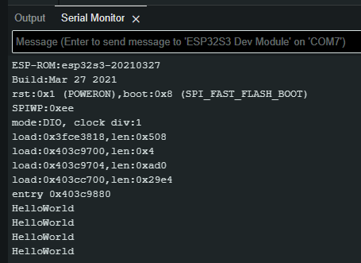

# Using JC8048W550

## Resources

* Hardware: https://www.aliexpress.com/item/1005006715818797.html
* Software: http://pan.jczn1688.com/directlink/1/HMI%20display/JC8048W550.zip
* Repo: https://github.com/memchi/JC8048W550
* https://github.com/memchi/JC8048W550/commits/main/

## Install ESP32 board

* Follow instructions from "\6-User_Manual\Getting started 5.0 Inch.pdf" 
* Do not use “Additional Boards Manager URLs” like in the picture, but from the text:
  * https://raw.githubusercontent.com/espressif/arduino-esp32/gh-pages/package_esp32_index.json
  * https://raw.githubusercontent.com/espressif/arduino-esp32/gh-pages/package_esp32_dev_index.json
* Or from: https://docs.espressif.com/projects/arduino-esp32/en/latest/installing.html#installing-using-arduino-ide 
  * https://espressif.github.io/arduino-esp32/package_esp32_index.json
  * https://espressif.github.io/arduino-esp32/package_esp32_dev_index.json


Ensure all the settings needed:


## Commissioning

### Original Code

* Zip contains several folders
* Use code subfolder “1-Demo\Demo_Arduino” from Repo
* Empty your Arduino folder: C:\Users\%USERNAME%\Documents\Arduino
* Copy in Minimum “3_1_Helloworld”, “3_2_Uart”, “3_3-4_TFT-LVGL-Widgets” and “libraries”

Do not let Arduino IDE update the libraries for now:


### 3_1_Helloworld



 <span style="background-color:#4F7942;">Working</span>

### 3_2_Uart

There is uppercase - lowercase confusion:


Do not let Arduino IDE do it for you, but rename the file from “3_2_uart.ino” to “3_2_Uart.ino”


<span style="background-color:#4F7942;">Working</span>

### 3_3-4_TFT-LVGL-Widgets

JC8048W550.zip contains already some libraries:


and others. Do not update for now.

First build leads to:

```
\Documents\Arduino\3_3-4_TFT-LVGL-Widgets\LvglWidgets\LvglWidgets.ino:30:10: fatal error: demos/lv_demos.h: No such file or directory
   30 | #include <demos/lv_demos.h>
  	|      	^~~~~~~~~~~~~~~~~~
compilation terminated.
exit status 1
Compilation error: demos/lv_demos.h: No such file or directory
```

* Copy folder "C:\Users\%USERNAME%\Documents\Arduino\libraries\lvgl\demos” to “C:\Users\%USERNAME%\Documents\Arduino\libraries\lvgl\src” according to "\6-User_Manual\Getting started 5.0 Inch.pdf"
* Copy file "C:\Users\%USERNAME%\Documents\3_3-4_TFT-LVGL-Widgets\LVGL configuration replacement file\lv_conf.h" over "C:\Users\%USERNAME%\Documents\Arduino\libraries\lv_conf.h" according to "\6-User_Manual\Getting started 5.0 Inch.pdf"

This is leading to:

```
In file included from c:\Users\memch\Documents\Arduino\libraries\Arduino_GFX-master\src/databus/Arduino_ESP32SPI.h:14,
             	from c:\Users\memch\Documents\Arduino\libraries\Arduino_GFX-master\src/Arduino_GFX_Library.h:19,
             	from C:\Users\memch\Documents\Arduino\3_3-4_TFT-LVGL-Widgets\LvglWidgets\LvglWidgets.ino:33:
C:\Users\memch\AppData\Local\Arduino15\packages\esp32\tools\esp32-arduino-libs\idf-release_v5.1-dc859c1e67\esp32s3/include/driver/deprecated/driver/periph_ctrl.h:7:2: warning: #warning driver/periph_ctrl.h header is no longer used, and will be removed in future versions. [-Wcpp]
	7 | #warning driver/periph_ctrl.h header is no longer used, and will be removed in future versions.
  	|  ^~~~~~~
In file included from c:\users\memch\documents\arduino\libraries\lvgl\src/core/lv_obj.h:140,
             	from c:\users\memch\documents\arduino\libraries\lvgl\lvgl.h:35,
             	from c:\Users\memch\Documents\Arduino\libraries\lvgl\src/lvgl.h:17,
             	from C:\Users\memch\Documents\Arduino\3_3-4_TFT-LVGL-Widgets\LvglWidgets\LvglWidgets.ino:29:
c:\users\memch\documents\arduino\libraries\lvgl\src\core\lv_obj_style.h: In function 'void lv_obj_remove_style_all(_lv_obj_t*)':
c:\users\memch\documents\arduino\libraries\lvgl\src\core\lv_obj_style.h:94:48: warning: bitwise operation between different enumeration types '<unnamed enum>' and '<unnamed enum>' is deprecated [-Wdeprecated-enum-enum-conversion]
   94 | 	lv_obj_remove_style(obj, NULL, LV_PART_ANY | LV_STATE_ANY);
  	|                                	~~~~~~~~~~~~^~~~~~~~~~~~~~
In file included from c:\Users\memch\Documents\Arduino\libraries\Arduino_GFX-master\src/Arduino_GFX_Library.h:4:
c:\Users\memch\Documents\Arduino\libraries\Arduino_GFX-master\src/Arduino_DataBus.h: At global scope:
c:\Users\memch\Documents\Arduino\libraries\Arduino_GFX-master\src/Arduino_DataBus.h:161:13: error: 'i80_device_list' has not been declared
  161 |   LIST_HEAD(i80_device_list, lcd_panel_io_i80_t)
  	|         	^~~~~~~~~~~~~~~
c:\Users\memch\Documents\Arduino\libraries\Arduino_GFX-master\src/Arduino_DataBus.h:161:3: error: ISO C++ forbids declaration of 'LIST_HEAD' with no type [-fpermissive]
  161 |   LIST_HEAD(i80_device_list, lcd_panel_io_i80_t)
  	|   ^~~~~~~~~
c:\Users\memch\Documents\Arduino\libraries\Arduino_GFX-master\src/Arduino_DataBus.h:161:48: error: expected ';' at end of member declaration
  161 |   LIST_HEAD(i80_device_list, lcd_panel_io_i80_t)
  	|                                            	^
  	|                                             	;
c:\Users\memch\Documents\Arduino\libraries\Arduino_GFX-master\src/Arduino_DataBus.h:162:3: error: 'device_list' does not name a type
  162 |   device_list; // Head of i80 device list
  	|   ^~~~~~~~~~~
c:\Users\memch\Documents\Arduino\libraries\Arduino_GFX-master\src/Arduino_DataBus.h:196:3: error: ISO C++ forbids declaration of 'LIST_ENTRY' with no type [-fpermissive]
  196 |   LIST_ENTRY(lcd_panel_io_i80_t)
  	|   ^~~~~~~~~~
c:\Users\memch\Documents\Arduino\libraries\Arduino_GFX-master\src/Arduino_DataBus.h:196:32: error: expected ';' at end of member declaration
  196 |   LIST_ENTRY(lcd_panel_io_i80_t)
  	|                            	^
  	|                             	;
c:\Users\memch\Documents\Arduino\libraries\Arduino_GFX-master\src/Arduino_DataBus.h:197:3: error: 'device_list_entry' does not name a type
  197 |   device_list_entry; // Entry of i80 device list
  	|   ^~~~~~~~~~~~~~~~~
In file included from c:\Users\memch\Documents\Arduino\libraries\Arduino_GFX-master\src/databus/Arduino_ESP32RGBPanel.h:18,
             	from c:\Users\memch\Documents\Arduino\libraries\Arduino_GFX-master\src/Arduino_GFX_Library.h:14:
C:\Users\memch\AppData\Local\Arduino15\packages\esp32\tools\esp32-arduino-libs\idf-release_v5.1-dc859c1e67\esp32s3/include/hal/esp32s3/include/hal/lcd_ll.h: In function 'void lcd_ll_enable_interrupt(lcd_cam_dev_t*, uint32_t, bool)':
C:\Users\memch\AppData\Local\Arduino15\packages\esp32\tools\esp32-arduino-libs\idf-release_v5.1-dc859c1e67\esp32s3/include/hal/esp32s3/include/hal/lcd_ll.h:558:33: warning: compound assignment with 'volatile'-qualified left operand is deprecated [-Wvolatile]
  558 |     	dev->lc_dma_int_ena.val |= mask & 0x03;
  	|     	~~~~~~~~~~~~~~~~~~~~~~~~^~~~~~~~~~~~~~
C:\Users\memch\AppData\Local\Arduino15\packages\esp32\tools\esp32-arduino-libs\idf-release_v5.1-dc859c1e67\esp32s3/include/hal/esp32s3/include/hal/lcd_ll.h:560:33: warning: compound assignment with 'volatile'-qualified left operand is deprecated [-Wvolatile]
  560 |     	dev->lc_dma_int_ena.val &= ~(mask & 0x03);
  	|     	~~~~~~~~~~~~~~~~~~~~~~~~^~~~~~~~~~~~~~~~~
c:\Users\memch\Documents\Arduino\libraries\Arduino_GFX-master\src/databus/Arduino_ESP32RGBPanel.h: At global scope:
c:\Users\memch\Documents\Arduino\libraries\Arduino_GFX-master\src/databus/Arduino_ESP32RGBPanel.h:43:3: error: 'esp_lcd_rgb_panel_frame_trans_done_cb_t' does not name a type; did you mean 'esp_lcd_panel_io_color_trans_done_cb_t'?
   43 |   esp_lcd_rgb_panel_frame_trans_done_cb_t on_frame_trans_done; // Callback, invoked after frame trans done
  	|   ^~~~~~~~~~~~~~~~~~~~~~~~~~~~~~~~~~~~~~~
  	|   esp_lcd_panel_io_color_trans_done_cb_t

exit status 1
Compilation error: exit status 1
```

<span style="background-color:#C70039;">Not working</span>

#### Try: Updating libraries

#### Try: Using Board version 2.017